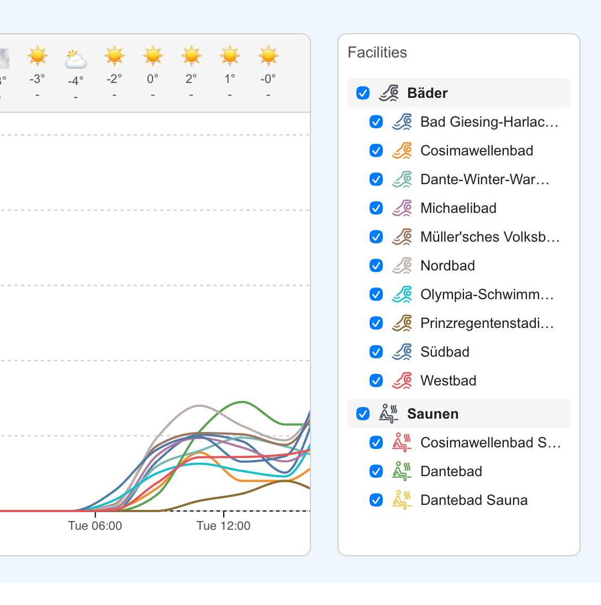

# Wider legend

## Problem
The legend box truncates long facility names (e.g., "Olympia-Schwimm...", "Prinzregentenstadi..."). Users cannot read the full names.

## Solution
Combine two changes:
1. **Increase legend width** to ~220px so most names fit without truncation
2. **Add tooltip** (`title` attribute) as fallback for any names that still overflow

This balances readability with preserving chart space.

## Implementation
1. Find the parent container constraining legend width and increase it
2. Add `title={facility}` to `FacilityName` in `Legend.tsx`

## Open Questions
1. What container constrains the legend width - Card component or layout?
2. Any responsive breakpoints to consider?
