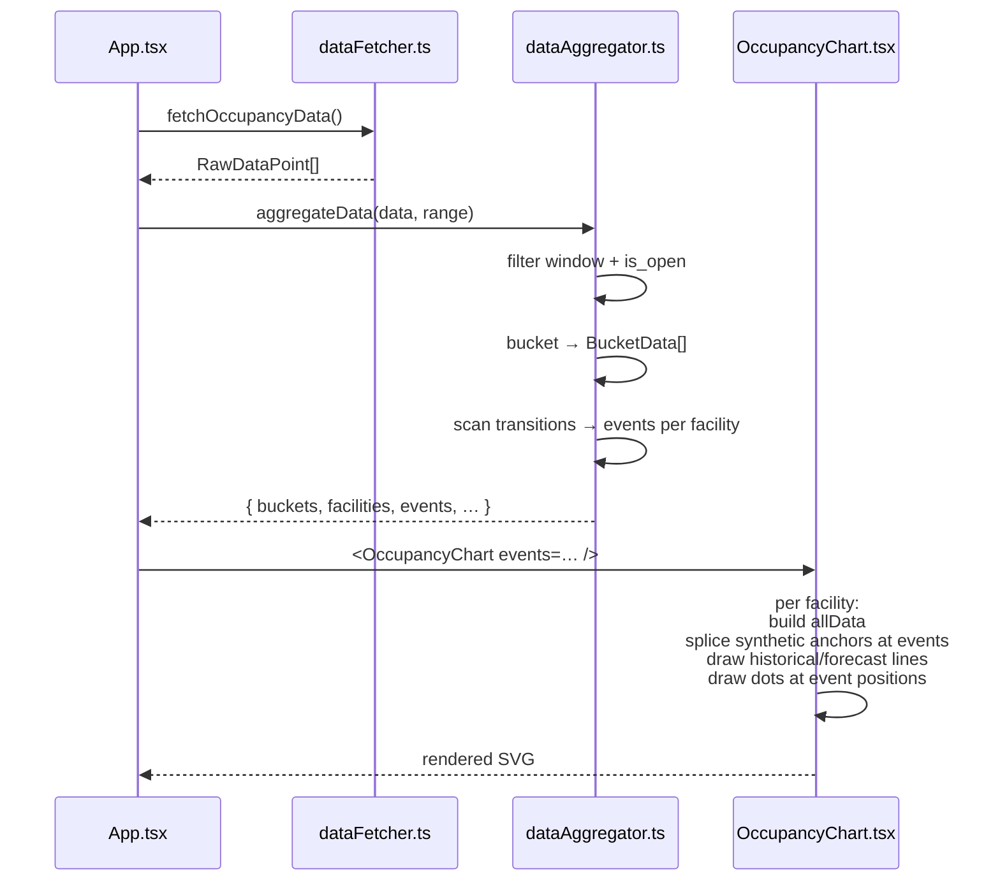
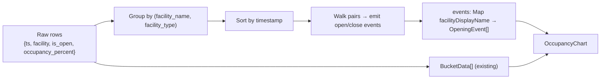

# Architecture — Chart Opening-Hours Markers

## Approach in one paragraph

Derive a per-facility list of open/close events from the raw CSV rows
inside the visible window, plumb that list through `aggregateData`'s
return value next to the existing buckets, and consume it in
`OccupancyChart.tsx` to (a) splice synthetic line endpoints at each
event's exact timestamp and (b) render small filled dots in the
facility's color at those endpoints. No new fetcher, no new types
beyond a small `OpeningEvent` interface.

## Why this approach (decision log)

### D1 — Detect events from CSV `is_open`, not from the JSON snapshot

**Considered:** fetch
`facility_openings_raw/facility_opening_*.json` directly and read
`weekly_schedule.<weekday>[].open/close` to get minute-precise
times.

**Chose:** scan transitions in the existing CSV.

**Trade-off:**
- Lose minute precision (CSV is hourly — close at 21:30 still shows
  as a 21:00 dot).
- Gain: zero new network calls, zero new file-listing complexity
  (the JSON files are date-stamped, so "latest" requires either a
  GitHub API call or a stable alias that doesn't exist yet), and one
  source of truth (the CSV's `is_open` is what the rest of the app
  already uses).
- For a chart that aggregates 7 days into 24 buckets, hour
  granularity is well below the visible resolution. If the upstream
  pipeline ever publishes `is_open` at a finer granularity, this
  approach picks it up automatically.

#### D1a — Implementation discovery (2026-04-27): upstream bug, since fixed

While implementing D1 we discovered that `is_open` in
`occupancy_historical.csv` was **broken upstream**: every historical
row carried `is_open=1` regardless of weekday or hour, with no
`0↔1` transitions ever. Bug filed and fixed same day —
`../swm_pool_data/Specs/changes/historical-is-open-not-overlaid/proposal.md`.

The viewer carried a brief stopgap (forecast-only event detection)
between bug discovery and the upstream fix. Once the fixed
historical CSV landed, the stopgap was dropped and D1 / D6 took
effect across the full window — no further code change needed.

### D2 — Splice synthetic line endpoints at event times

**Considered:** draw dots independently and let the line follow
whatever bucket midpoints `aggregateData` produces. The eye
reconciles them.

**Chose:** insert a synthetic `{ time: event.time, value:
interpolated }` point into each facility's line data at every event,
so the line terminates exactly at the dot.

**Trade-off:**
- Slightly more code in the chart's per-facility loop.
- The pattern already exists for the historical→forecast splice at
  `now` (see `OccupancyChart.tsx:281–297`). Reusing the pattern
  keeps the visual grammar consistent: a transition is *always* a
  splice + a marker.
- Avoids the "line ends 30 min before the dot" visual
  mismatch that pure overlay would create when bucket midpoints
  don't coincide with hour boundaries.

### D3 — Compute events in `dataAggregator.ts`, not in the chart

**Considered:** push event detection into `OccupancyChart.tsx`,
keep `dataAggregator` focused on buckets.

**Chose:** add event detection alongside bucketing in
`aggregateData`.

**Trade-off:**
- The aggregator already has the raw CSV grouped by facility and
  filtered by visible window — that's exactly the input event
  detection needs. Doing it elsewhere would re-walk the data.
- Keeps the chart component a *renderer* (its current role), not a
  data-processor. This matches the file's existing shape.
- One extra return field on `aggregateData` is mild API growth;
  acceptable.

### D4 — Hour granularity and dot placement

Events are emitted at the *exact CSV row timestamp* of the
transition. The bucket-midpoint visual offset that exists for the
*line* doesn't apply to dots — dots are drawn at `event.time`
directly. Then the spliced anchor point ensures the line meets the
dot. The visual grammar:

> "Wherever you see a dot, the line either ends or begins there."

### D5 — Splice value: linear interpolation from neighbours

When inserting a synthetic anchor at an event time, its `value` is
linearly interpolated from the nearest preceding bucket midpoint and
the nearest following bucket midpoint *in the same line segment*
(historical or forecast). For an `open` event with no preceding
bucket value (start of an open run), use the *following* bucket's
value. Same idea symmetrically for `close`.

This is approximate — the dot won't sit on the data's true value at
that exact minute — but it gives a smooth visual that the eye
accepts. We don't pretend to know occupancy outside open hours, so
extrapolating into the closed region is forbidden.

**Sentinel safety (Spec 15 carry-over).** The interpolation source
is bucket midpoints, and buckets are built from the post-`is_open`-
filter slice (`dataAggregator.ts:79–84, 97–103`). Sentinel
`is_open=0, occupancy_percent=0` rows never reach a bucket, so the
`100 − 0 = 100` inversion bug Spec 15 fixed cannot re-enter through
this path. Treat this as a structural invariant: any future code
that wants the value at an event time must read it through the
bucket layer, never directly from the raw row.

### D6 — Re-apply overlap dedup inside event detection

Spec 15 dropped forecast rows with `timestamp <= maxHistoricalTime`
to keep stale predictions out of bucket averages. That filter lives
in the *bucketing* path; it does **not** carry over for free to our
event-detection pass, because event detection deliberately runs on
the pre-`is_open`-filter slice (it needs to see the `0`s to detect
flips).

**Required:** before scanning a facility's row stream for
transitions, dedup `(facility, timestamp)` with **historical wins**,
*and* drop forecast rows where `timestamp <= maxHistoricalTime`.
Same rule the bucketing path uses, applied independently.

Without this:

```
facility = "Bad Giesing-Harlaching"
sorted rows in overlap region:
  hist 06:45  is_open=0
  hist 07:00  is_open=1   ← genuine open transition
  forecast 07:00  is_open=1
  hist 07:15  is_open=1
  …
```

A naive walk over `(prev, curr)` pairs treats the duplicate `07:00`
forecast row as a no-op (`1 → 1`), which happens to be benign here.
But if forecast and historical disagree on `is_open` for the same
hour (e.g. schedule changed mid-day, holiday rule, late upstream
re-overlay) the duplicate flips a phantom event into existence.
Cheaper to dedup once than to debug a stray dot.

## Component interactions



## Data flow



## Module changes

### `app/src/types.ts`

Add:

```ts
export interface OpeningEvent {
  time: Date;
  type: 'open' | 'close';
  isForecast: boolean; // for choosing solid vs dashed dot styling, if needed
}
```

Extend `aggregateData`'s return type:

```ts
{
  buckets: BucketData[];
  facilities: string[];
  facilityTypes: Map<string, string>;
  lastDataTimestamp: Date | null;
  openingEvents: Map<string, OpeningEvent[]>; // key = display name
}
```

### `app/src/utils/dataAggregator.ts`

After `filteredData` is built (the dedup'd list of in-window rows),
*before* it gets `is_open === 0`-filtered for bucketing, derive
events. Important: event detection needs the **closed** rows too —
otherwise transitions are invisible — so we run it on the in-window,
in-range raw slice, not on the bucket-input filtered slice.

Plan:

1. Take `data.filter(p => inRange(p.timestamp))` (no `is_open`
   filter — we need the `0`s to detect close transitions).
2. **Apply Spec 15's overlap rule (D6):** drop forecast rows where
   `timestamp <= maxHistoricalTime`; for any remaining `(facility,
   timestamp)` collision (historical and forecast at same minute),
   keep historical. `maxHistoricalTime` is the same value the
   bucketing path computes; reuse it.
3. Group by display-name, sort by timestamp ascending.
4. Walk pairs, emit events as defined in `domain.md`.
5. Tag each event with `isForecast = timestamp > maxHistoricalTime`.
6. Return as a `Map<displayName, OpeningEvent[]>`.

The function signature change is additive; no caller change beyond
`App.tsx` forwarding the new field to `OccupancyChart`.

### `app/src/components/OccupancyChart.tsx`

Add prop:

```ts
openingEvents: Map<string, OpeningEvent[]>;
```

Inside the per-facility loop, after the existing
`historicalData`/`forecastData` split and the existing `Jetzt`
splice:

1. **Splice event anchors.** For each event of the facility within
   the visible window:
   - Find which segment it belongs to (`historicalData` if
     `event.time <= maxHistoricalTime`, else `forecastData`).
   - Compute interpolated value from neighbouring points in that
     segment per D5.
   - Insert the synthetic point at the right position (sorted by
     time).
2. **Draw dots.** For each event, append an SVG `circle`:

   ```ts
   g.append('circle')
     .attr('cx', xScale(event.time))
     .attr('cy', yScale(splicedValueAtEvent))
     .attr('r', 3.5)
     .attr('fill', color)
     .attr('stroke', 'white')
     .attr('stroke-width', 1);
   ```

   The white stroke gives the dot enough separation from the line
   ink so it reads as a marker, not a thickening of the line.

3. **Gap enforcement.** With the splice in place and `line.defined`
   already gating on `value != null`, the existing line generator
   produces no segment across closed gaps automatically — provided
   no synthetic point is inserted *inside* a closed gap. The
   anchor-insertion logic must respect this: an `open` event becomes
   the *first* point of a new open run; a `close` event becomes the
   *last* point of the current open run. Between consecutive
   `close`→`open` events, there are no points → no line.

### `app/src/App.tsx`

Wire the new field through:

```diff
- const { buckets, facilities, facilityTypes, lastDataTimestamp } = aggregateData(...);
+ const { buckets, facilities, facilityTypes, lastDataTimestamp, openingEvents } = aggregateData(...);
…
- <OccupancyChart buckets={…} facilities={…} … />
+ <OccupancyChart buckets={…} facilities={…} openingEvents={openingEvents} … />
```

## Integration points & risks

| Risk | Mitigation |
|------|------------|
| Dots drawn for `is_open === null` rows (unknown facility) misfire as transitions | Treat `null` as "open" only for *line continuity*, not as a transition trigger. Events fire only on `0↔1` flips, never on `null`. |
| Stale forecast row in the historical/forecast overlap injects a phantom transition (`is_open` disagrees with the live scrape at the same minute) | D6: drop forecast rows where `ts <= maxHistoricalTime`, dedup `(facility, ts)` with historical winning, before the event scan. |
| Spec 15's "100 % spike" regression sneaks back in through the splice path | D5 invariant: anchor values come from buckets, never from raw rows. Verified by the success-criterion (4) screenshot in `plan.md`. |
| Window-edge synthetic events clutter the chart | Per `domain.md` rule 3, do not emit events at the very first/last row of the window. |
| Splicing inserts a point inside a closed gap → line bridges the gap | Strict invariant: `open` event anchors go to the start of the next open run; `close` event anchors go to the end of the previous open run. Verified by walking the segment after splicing and asserting no two adjacent points straddle a closed-event timestamp. |
| Dots overlap on dense days | Acceptable for v1 — typical pool has at most 1 open + 1 close event per day. Re-evaluate only if a facility shows multiple opening windows in a single day. |
| Visual conflict with the `Jetzt` red marker | Both render in the same group; dots are facility-color and the `Jetzt` line is a vertical 2 px red line, so collision is benign. |
| Extra render cost | At most ~17 facilities × ~14 events/week = 238 circles; negligible. |

## Testing strategy

There is no unit-test harness in this repo today (see Spec 15
"Testing" section). Verification is manual + screenshot-based:

1. `npm start`, open `http://localhost:3000`.
2. Save before/after screenshots in `.tmp/` (project rule from
   `CLAUDE.md`).
3. Verify per the `proposal.md` success criteria (1)–(4).
4. Toggle a facility off in the legend; confirm both line and dots
   disappear together.
5. Toggle the time range between `week` and `2days`; confirm dots
   re-derive correctly for the new window.

Setting up automated tests is out of scope for this change; if added
later, an aggregator-level unit test on `openingEvents` (pure
function, no DOM) is the highest-leverage starting point.
