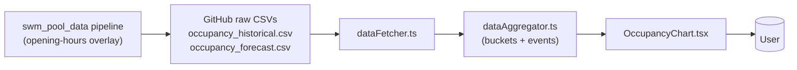

# Domain Notes — Opening Hours

This change relies on opening-hours concepts that already exist in the
upstream `swm_pool_data` pipeline. Nothing new is being modeled — the
purpose of this document is to pin down the vocabulary the viewer
will use when rendering and reasoning about open/close transitions.

## Concepts

### Facility

A `(facility_name, facility_type)` pair, e.g.
`("Bad Giesing-Harlaching", "pool")`. Each facility has its own
weekly schedule, its own occupancy line, and therefore its own
sequence of open/close dots.

### Opening hours

For a given facility, the set of (weekday, open_time, close_time)
triples describing when it is scheduled to be accessible to the
public. Source of truth upstream is
`facility_openings_raw/facility_opening_*.json` →
`weekly_schedule[<weekday>] = [{open: "HH:MM", close: "HH:MM"}, …]`.

The viewer does **not** read that JSON. It infers opening hours from
the `is_open` column on the hourly CSV rows that the upstream
pipeline already overlays.

### `is_open` (the contract the viewer relies on)

Per CSV row, three-valued:

| `is_open` | Meaning |
|-----------|---------|
| `1` | Facility scheduled open at this hour |
| `0` | Facility scheduled closed at this hour (sentinel; `occupancy_percent = 0` is **not** a real reading) |
| `null` | Facility missing from the opening-hours snapshot — treat as "unknown / assume open" |

Already documented in `app/src/types.ts` and Spec 15. This change
does not redefine it; it just adds a new derived concept on top.

**Historical note (2026-04-27):** an upstream bug had historical
rows ignoring this contract (every row was `is_open=1`). It was
filed and fixed the same day —
`../swm_pool_data/Specs/changes/historical-is-open-not-overlaid/proposal.md`.
The contract above now holds uniformly for both data sources.

### Sentinel trap (already fixed by Spec 15 — guardrail only)

The viewer renders **occupancy** as `100 - occupancy_percent` (CSV
column reports *available capacity*; the chart shows *fill*). For an
`is_open = 0` row this trips the trap:

```
occupancy_percent = 0       (sentinel: facility closed)
displayed value   = 100 - 0 = 100 %  ← false "fully crowded" spike
```

Spec 15 fixed this for the line by filtering `is_open = 0` rows out
before bucketing. Our design inherits the fix structurally: synthetic
line-anchor values are interpolated from neighbouring **bucket
midpoints**, and buckets are built from the post-filter slice. A
sentinel row can never reach the interpolation step.

This domain note exists as a *guardrail*: any future shortcut that
reads `occupancy_percent` directly from a row (skipping the bucket
layer) re-opens the trap. Don't.

### Forecast / historical overlap

The forecast CSV is regenerated daily at ~07:00 Berlin time and
covers the day from 07:00 onward; the historical CSV is appended to
every 15 minutes. They overlap from 07:00 up to "now". In this
overlap window, both files carry rows for the same `(facility,
timestamp)`.

Spec 15 rule: in the overlap, **historical wins**. Forecast rows
where `timestamp <= max(historical.timestamp)` are dropped (they're
now-stale model predictions for a time we already have a live
scrape for).

The bucketing pipeline already enforces this (`dataAggregator.ts`
lines 86–116). Event detection — which must run on *pre-`is_open`-
filter* rows so it can see the closed sentinels — has to enforce
the same dedup rule independently, otherwise the sort+walk over
combined rows produces ghost or contradictory transitions at the
overlap boundary.

### Opening event

A *new* derived concept introduced by this change. An opening event
is one of:

- **`open` event**: the moment a facility transitions from
  closed/unknown-gap to open. In CSV terms: the timestamp of the
  first `is_open = 1` row in a contiguous run of open hours.
- **`close` event**: the moment a facility transitions from open to
  closed. In CSV terms: the timestamp of the last `is_open = 1` row
  before a gap or before an `is_open = 0` row.

Events live per facility, are time-ordered, and are derived
deterministically from the visible-window slice of the CSV. They are
the data behind the dots.

### Closed gap

A contiguous time interval `[close_event.time, next_open_event.time)`
during which the facility is not open. The viewer's contract is:
**no line is drawn across any closed gap.**

Closed gaps already existed implicitly (Spec 15 dropped closed rows
before bucketing). This change makes them explicit and bounded by
events.

## How concepts relate

```mermaid
flowchart TD
  CSV["occupancy_*.csv rows<br/>per facility, hourly<br/>is_open ∈ {0, 1, null}"]
  EVENTS["Opening events<br/>open/close at hour boundaries"]
  GAPS["Closed gaps<br/>(close → next open)"]
  DOTS["Chart dots<br/>at event time, line color"]
  LINE["Chart line<br/>terminates at events,<br/>absent during gaps"]

  CSV -->|scan transitions| EVENTS
  EVENTS -->|pair consecutive close→open| GAPS
  EVENTS -->|render at time, value-of-line| DOTS
  EVENTS -->|splice anchor points| LINE
  GAPS -.->|line.defined() == false| LINE
```

## Process: deriving events from a facility's row stream

1. Take the rows for the facility within the visible window, sorted
   by `timestamp`.
2. Walk the rows. For each pair `(prev, curr)`:
   - If `prev.is_open !== 1` and `curr.is_open === 1` → emit
     **open** event at `curr.timestamp`.
   - If `prev.is_open === 1` and `curr.is_open !== 1` → emit
     **close** event at `prev.timestamp` (the *last* open hour, not
     the first closed hour — that's where the line should end).
3. Boundary handling:
   - If the very first row is `is_open === 1`, *do not* emit an
     opening event. The window started mid-open, the dot would be
     cosmetic noise.
   - Same for the very last row: no synthetic close event at window
     end.
4. `is_open === null` is treated as "unknown / assume open" — it
   does not by itself trigger close/open transitions. (Matches Spec
   15.)

## Actors



The upstream pipeline owns the *data* contract (`is_open`); the
viewer owns the *display* contract (events, dots, gaps). This change
only touches the viewer side.
