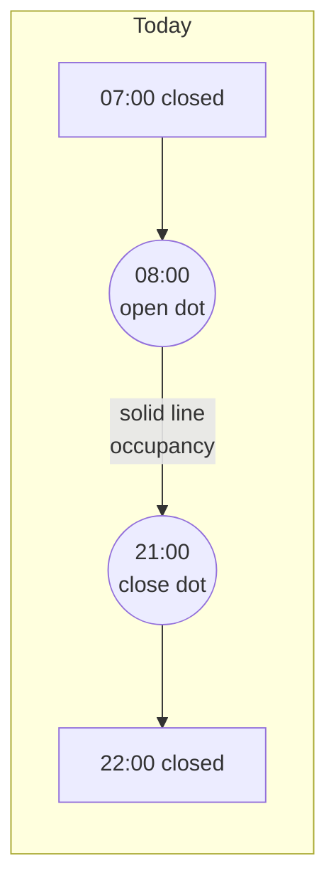

# Chart Opening-Hours Markers

## What

Make the open/close transitions of each facility visible on the
occupancy chart:

- A small filled **dot in the facility's line color** at every opening
  time and every closing time within the visible window.
- **No line during closed hours.** The line literally ends at the
  closing dot and resumes at the next opening dot of the same facility.

## Why

Spec 15 (`15_OPENING_HOURS_AWARE_VIEWER.md`) made the chart drop closed
hours so the false 100 % spike disappeared. That fixed correctness but
the result is silent — closed periods are just empty gaps with no
explanation. A user who knows a facility is "always 0 %" at 06:00 has
no signal that 06:00 is *outside opening hours* vs. genuinely empty.

Opening-hours data is now first-class in the upstream pipeline (every
forecast row carries `is_open ∈ {0, 1, NULL}`, plus a daily
`facility_openings_raw/facility_opening_*.json` snapshot with explicit
`weekly_schedule` per facility). The viewer already has the signal it
needs — it just doesn't render it.

Adding visible markers turns the silent gap into a narrative: "this
pool opens at 08:00, closes at 21:00, and what you see between the
dots is the day's actual usage." Same data, dramatically more
legible.

## Scope

**In scope:**

- Detect open/close transitions per facility from existing
  `is_open` data in the historical + forecast CSVs.
- Render dots at those transition times on the existing
  `OccupancyChart`, in the facility's line color, sized to read as
  markers (not as data points).
- Enforce that the per-facility line ends/resumes exactly at the dot
  positions — i.e. no rendered line runs across a closed gap.
- Apply uniformly to historical (solid line) and forecast (dashed
  line) segments.

**Out of scope:**

- Fetching `facility_openings_raw/*.json` directly. The hourly
  `is_open` flag in the existing CSVs is sufficient for hour-level
  precision and avoids a second data dependency. (Re-evaluate only if
  hour-level precision proves insufficient.)
- A separate weekly-schedule UI panel ("Mo–Fr 08:00–21:00").
- Showing dots for facilities the user has hidden via the legend.
- Tooltips on the dots.
- Indicating *seasonal* closure (`status: "closed_for_season"` from
  the JSON). Out of scope for this change; if that signal becomes
  useful it can be a follow-up.

## Expected outcome

Visually:

- Each visible facility shows a series of small filled circles at its
  opening and closing hours within the chart's time window.
- The line stops exactly under each closing dot and the next segment
  begins exactly under the following opening dot.
- Behavior across the historical→forecast boundary stays as it is
  today (the existing "splice at Jetzt" logic still works).
- Day/night background, midnight markers, and the `Jetzt` line are
  unchanged.

Functionally:

- No new network requests.
- No new schema or build-system change.
- `dataAggregator` exposes a per-facility list of opening events
  alongside its existing bucket output; `OccupancyChart` consumes
  those events to splice line endpoints and draw dots.

## Success criteria

1. For a facility scheduled 08:00–21:00, the chart on a typical day
   shows: gap → opening dot at ~08:00 → solid/dashed line through the
   day → closing dot at ~21:00 → gap.
2. No line segment crosses a closed period for any facility.
3. Hidden facilities (legend toggle off) show neither line nor dots.
4. The 100 %-spike regression from Spec 15 does not return.
