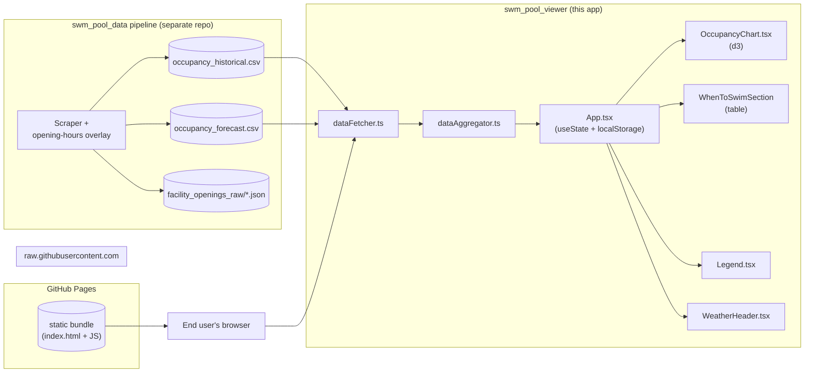
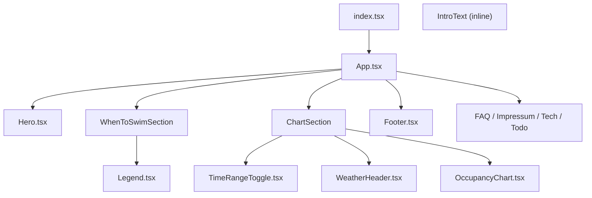

# Architecture

## Overview

A static single-page React + TypeScript site that fetches CSVs from
an upstream GitHub-hosted data pipeline at runtime and renders an
interactive D3 chart plus auxiliary tables. No server, no API, no
database — everything happens in the browser.



The viewer never reads `facility_openings_raw/*.json` directly
today — opening hours are inferred from the `is_open` column the
upstream overlay places on every CSV row.

## Technology stack

| Layer | Choice | Role |
|-------|--------|------|
| UI framework | React 18 | Component model, hooks, no SSR. |
| Language | TypeScript | Types live in `src/types.ts`; strict tsc. |
| Styling | `styled-components` + a hand-rolled theme (`src/styles/theme.ts`) | Tokens for colours, spacing, breakpoints. |
| Charting | D3.js | Hand-written SVG composition inside a `useEffect`; no React-D3 wrapper. |
| Routing | `react-router-dom` | Multi-page (FAQ, Impressum, Tech, Todo). |
| CSV parsing | `papaparse` | Header + dynamicTyping. |
| Markdown pages | `react-markdown` + `gray-matter` + `react-syntax-highlighter` | Static content pages. |
| Build | Webpack 5 + ts-loader | Single bundle (currently ~1.2 MiB). |
| Hosting | GitHub Pages (CNAME committed in `app/public/`) | Pure static. |

## Components



### Module responsibilities

- **`utils/dataFetcher.ts`** — Two `fetch` + Papa Parse calls,
  combined into one row array. No retry, no caching beyond the
  browser HTTP cache.
- **`utils/dataAggregator.ts`** — Pure transform: raw rows + range
  → `{ buckets, facilities, facilityTypes, lastDataTimestamp,
  openingEvents }`. Owns the Spec 15 overlap dedup and the
  open/close event derivation.
- **`utils/colors.ts`** — Stable colour assignment per facility
  display name.
- **`utils/weatherIcons.ts`** — Maps Open-Meteo weather codes to
  an icon glyph + label.
- **`components/OccupancyChart.tsx`** — Pure renderer of buckets +
  events. Manages SVG composition, day/night background, midnight
  gridlines, `Jetzt` marker, line splices, dot rendering.
- **`components/WhenToSwimSection/*`** — Hour-grouped occupancy
  table with a slot picker; renders `geschl.` for `is_open=0`
  rows and a percent gauge otherwise.
- **`components/Legend.tsx`** — Grouped facility list with checkbox
  toggles; group toggles propagate down.
- **`App.tsx`** — Orchestrates fetch, aggregation, state
  (visibility, time range, swim-time slot), and `localStorage`
  persistence.

## Data

The viewer holds no persistent data of its own. State that survives
a reload lives in `localStorage` under the key
`swm-pool-viewer-state`:

```ts
interface SavedState {
  timeRange?: 'week' | '2days';
  visibility?: Record<string, boolean>;     // by display name
  swimTimeSelection?: TimeSlotSelection;    // WhenToSwim slot pick
}
```

In-memory data is the parsed CSV rows (`RawDataPoint[]`), the
aggregated `BucketData[]`, and the per-facility
`OpeningEvent[]` map. Types are defined in `src/types.ts`.

## System boundaries

### Upstream (consumed)

- `https://raw.githubusercontent.com/tillg/swm_pool_data/refs/heads/main/datasets/occupancy_historical.csv`
- `https://raw.githubusercontent.com/tillg/swm_pool_data/refs/heads/main/datasets/occupancy_forecast.csv`

Both URLs are pinned in `dataFetcher.ts`. Schema (`RawDataPoint`)
is documented in `src/types.ts`. The `is_open` three-state
contract is the contractual hand-off from the upstream pipeline;
both rows of either source carry it.

### Downstream (exposed)

None. The viewer is a leaf: it serves humans, not other systems.

### Operational

- Built and deployed via GitHub Pages from this repo (CNAME
  committed in `app/public/CNAME`).
- No CI checks gate deploys today.
- No telemetry, no analytics endpoint.

## External systems

- **swm_pool_data** (sibling repo) — sole data provider.
  Contractual integration; bugs are filed there as `Specs/changes/<name>/proposal.md`. The opening-hours overlay
  bug `historical-is-open-not-overlaid` (filed 2026-04-27, fixed
  same day) is the most recent example.
- **GitHub raw / GitHub Pages** — purely transport.

## Infrastructure

- Static hosting via GitHub Pages.
- Bundler: Webpack dev server for local (`npm start` → port 3000),
  Webpack production build for deploy (`npm run build` → `app/dist`,
  copied/published from there).
- No Docker, no server-side runtime, no environment variables.
