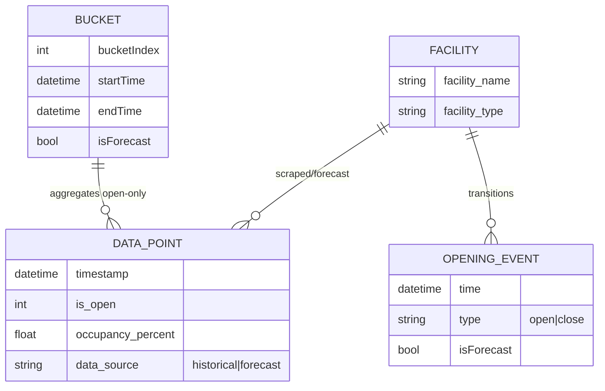
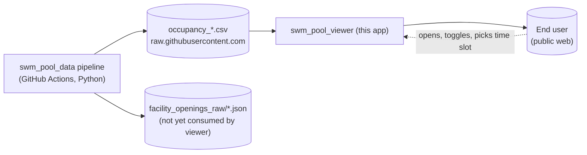
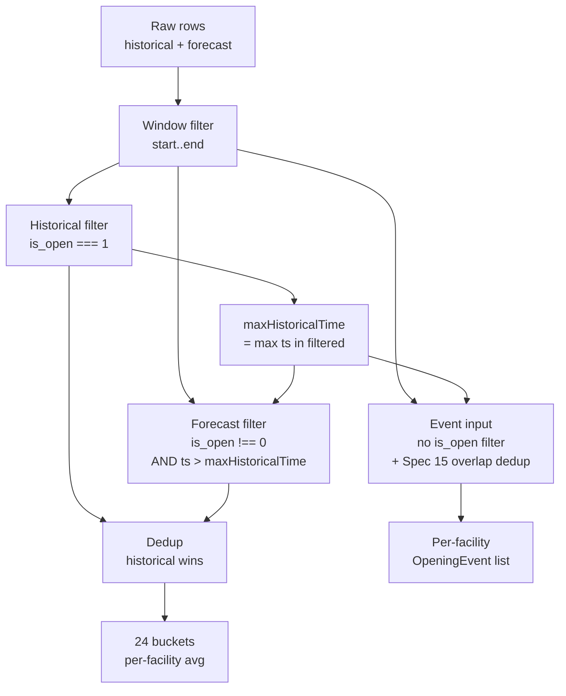

# Domain

## Purpose

The viewer is a private, public-facing website that visualises how
crowded the **Munich SWM** (Stadtwerke München) public swimming
pools, saunas, and ice rink currently are and how crowded they were
recently. It helps Munich residents pick a less-busy time to visit a
specific facility.

The viewer is **read-only**; it neither owns nor mutates data. All
data is produced by the upstream `swm_pool_data` pipeline and
consumed via raw GitHub URLs.

## Vocabulary

| Term | Meaning |
|------|---------|
| **Facility** | A `(facility_name, facility_type)` pair — e.g. `("Bad Giesing-Harlaching", "pool")`. Identified uniquely by that pair; rendered with a display-name suffix for non-pools (e.g. "(Sauna)"). |
| **Facility type** | One of `pool`, `sauna`, `ice_rink`. Drives grouping in the legend, the icon shown next to the name, and the display-name suffix. |
| **Occupancy** | What the chart and table show: `100 − occupancy_percent` (percent crowded). The upstream CSV column reports *available capacity*; the viewer inverts it once at read time so every UI surface is consistent. |
| **Bucket** | One of 24 evenly-spaced time slices that the visible window is aggregated into for the chart. Bucket width = `window / 24` (≈ 7 h on the week view, ≈ 2 h on the 2-day view). |
| **Time range** | One of `week` (last 7 days through forecast horizon) or `2days` (last 2 days through forecast horizon). User-selectable, persisted in `localStorage`. |
| **Historical / forecast** | The viewer's two data segments. Historical = live scrapes (15-min cadence); forecast = model predictions (hourly). The visual split is solid line vs. dashed line, with the boundary anchored at the latest live scrape. |
| **`is_open`** | Schedule flag on every CSV row: `1` open, `0` scheduled-closed (sentinel — `occupancy_percent` is **not** a real reading), `null` facility absent from the opening-hours snapshot. Honoured uniformly across both data sources after the upstream `historical-is-open-not-overlaid` fix (2026-04-27). |
| **Opening event** | A `0↔1` flip in the `is_open` column for one facility — derived per-facility from the merged in-window CSV stream. Surfaces in the chart as a coloured dot at the open or close moment. |
| **Closed gap** | The interval between a `close` event and the next `open` event for a facility. Contractually: **no line is drawn during a closed gap**. |
| **WhenToSwim** | The hourly comparison table at the top of the page that shows `geschl.` for closed hours and a green percent gauge for open hours, helping a user pick a time slot. |

## Concepts and relationships

## Actors

- **Upstream pipeline** owns scrape cadence, the deterministic
  opening-hours overlay, and the CSV emit format. The viewer trusts
  it.
- **End user** is anonymous, has no account. State that needs to
  survive a reload (visibility toggles, time range, "when to swim"
  slot pick) lives in `localStorage` only.

## Processes

### Page load (cold)

1. Browser loads bundle, mounts `<App>`.
2. `dataFetcher.fetchOccupancyData` issues two `fetch` calls in
   parallel against the upstream raw CSV URLs.
3. CSVs are parsed by Papa Parse (header-based, with dynamic
   typing).
4. Combined rows are passed to `aggregateData`, which produces the
   bucket array, the facility list, the per-facility opening events
   (see below), and the latest historical timestamp.
5. The chart and the WhenToSwim table render.

### Aggregation (per visible time range)

### Rendering the occupancy chart (per facility)

1. Compute closed intervals from the facility's `OpeningEvent[]`.
2. Drop bucket midpoints that fall inside a closed interval.
3. Split surviving midpoints into historical and forecast segments
   by bucket flag.
4. Splice a synthetic anchor at `now` between the two segments
   (existing pre-change behaviour).
5. Splice each opening event as a synthetic anchor in its segment;
   for every `close` event, append a NaN sentinel right after, so
   d3's `line.defined()` breaks the path during the closed gap.
6. Draw the historical (solid) and forecast (dashed) paths.
7. Draw small filled circles at each event time in the facility's
   line colour — line "ends/begins" at every dot.

## Rules and constraints

- **Sentinel safety.** `is_open=0` rows have `occupancy_percent=0`
  by upstream contract; the viewer's `100 − occupancy_percent`
  inversion would otherwise paint them as 100 % full. Never read
  `occupancy_percent` from an `is_open=0` row. Enforced by
  filtering closed rows out before bucketing; chart anchor values
  are interpolated only from bucket midpoints (i.e. open data),
  never from raw rows.
- **Overlap precedence.** Where historical and forecast overlap on
  the same `(facility, timestamp)`, **historical wins**. Stale
  forecast for already-scraped minutes is dropped.
- **Closed-gap invariant.** No line ink and no synthetic line
  point may exist between a `close` event and the next `open`
  event of the same facility.
- **Display name uniqueness.** A facility's identity is `(name,
  type)`; the display name disambiguates by appending `(Sauna)`
  for saunas. Ice rinks keep their original name (they're already
  unique).
- **No write path.** The viewer never POSTs anywhere. The only
  stateful side effect is `localStorage`.
