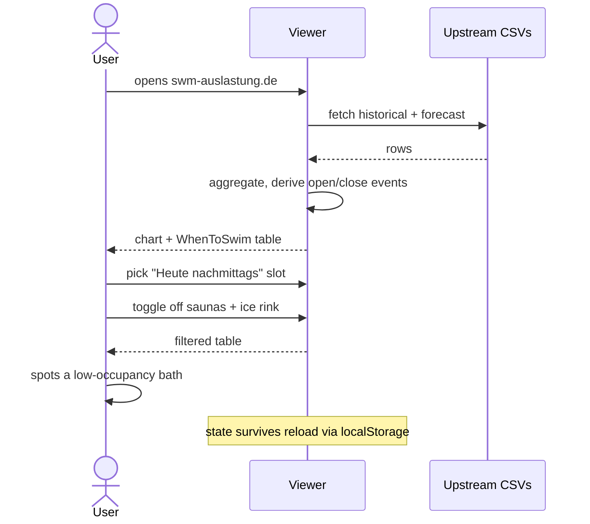
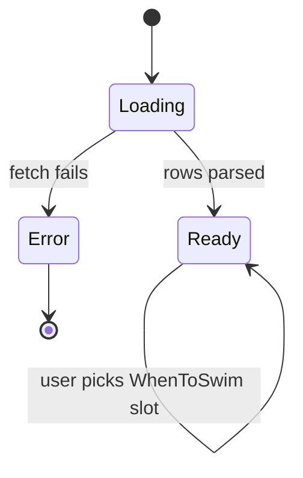

# Functional

What the viewer lets a user do, independent of how it's built.

## Audience

Anonymous public-web visitors. No accounts, no roles, no
permissions. Everyone sees the same data.

## Features

### Occupancy chart (`Auslastung-Historie`)

The headline visual: one line per facility, colour-coded, plotted
across the selected time range. Driven by `OccupancyChart.tsx`.

| Capability | Notes |
|---|---|
| Solid line for historical, dashed for forecast | Boundary anchored at the latest live scrape; a synthetic point is spliced at "Jetzt" so the visible solid→dashed transition lands exactly on the red `Jetzt` line. |
| Open/close dots in the line colour | Small filled circles at every `0↔1` `is_open` flip. The line ends at the closing dot and resumes at the opening dot. |
| No line during closed periods | Bucket midpoints inside a closed gap are dropped before plotting; a NaN sentinel after each close anchor breaks the d3 path. |
| `Jetzt` marker | Vertical red line + label at the current time. |
| Day/night background | Subtle slate-gray banding, exponentially sharper than a plain cosine to read more like real daylight. |
| Midnight gridlines | Dashed verticals at every midnight in the visible window. |
| Y axis | `0–100 %` Auslastung. |
| X axis | Up to ~6 ticks at bucket end times, labelled `<weekday-de>` ⏷ HH:MM. The last tick is right-anchored so it doesn't overflow. |

### Time range toggle

`Letzte Woche` (7 days back through the forecast horizon) /
`Letzte 2 Tage` (2 days back through the forecast horizon). Saved to
`localStorage`. Default is `week`.

### Legend

Grouped by facility type (`Bäder`, `Saunen`, `Eislaufbahnen`).
Each row is an icon + display name + checkbox. Group headers act as
master toggles. Visibility map persists in `localStorage`.

### WeatherHeader

A row aligned with the chart's bucket boundaries showing per-bucket
temperature (°C), precipitation (mm), and a weather icon. Sourced
from the same CSV (Open-Meteo features).

### WhenToSwim section

A table answering "where should I swim *at this slot*?". Driven by
`WhenToSwimSection/`.

| Capability | Notes |
|---|---|
| Slot picker (`TimeSlotSelector`) | Predefined slots (`Heute früh morgens`, `Heute mittags`, `Heute nachmittags`, `Morgen früh morgens`, …). Selection persists in `localStorage`. |
| Per-facility row × per-hour column matrix | One row per facility (filtered by visibility), one column per hour in the chosen slot. Each cell shows either `geschl.` (closed) or a green percent gauge (open). |
| Closed handling | A cell is `geschl.` whenever its underlying row has `is_open === 0`, regardless of data source (Spec 15). |
| Group toggles in legend | The legend within the WhenToSwim section uses the same visibility state as the chart's legend — toggling one toggles both. |

### Static pages

Reachable from the footer; HashRouter routes:

| Route | Title | Source |
|-------|-------|--------|
| `/` | Main viewer | `App.tsx` |
| `/#/tech` | Technischer Hintergrund | `pages/TechExplain.tsx` (markdown) |
| `/#/faq` | FAQ | `pages/Faq.tsx` (markdown) |
| `/#/impressum` | Impressum | `pages/Impressum.tsx` (markdown) |
| `/#/todo` | Was noch kommt | `pages/Todo.tsx` (markdown) |

Markdown is rendered by `MarkdownPage.tsx` with
`react-markdown` + `react-syntax-highlighter` for code blocks.

### Footer

Same on every page. Shows build version (`Build <hash> vom <date>`),
links to the static pages, and a copyright line.

## User journeys

### "Should I swim this afternoon?"

### "How does this work?"

User clicks `Technischer Hintergrund` in the footer →
HashRouter renders `pages/TechExplain.tsx` →
`MarkdownPage` parses and renders the markdown source.

## Inputs and outputs

- **Inputs (HTTP fetch)**: two CSVs from upstream. No user-supplied
  data is ever sent anywhere.
- **Outputs**: rendered DOM only. No exports, no PDF, no email.
- **Side effects**: `localStorage` writes for view state.

## States and persistence

The `Loading` and `Error` states are explicit branches in
`App.tsx` (Spinner / ErrorMessage). `Ready` is the steady state;
all subsequent UI changes mutate state in place and re-render.

## Permissions and visibility

None. Public site, no auth.

## Known limitations / edge cases

- **Forecast horizon**: ~48 h. Past that, dots/lines just stop —
  no events are emitted beyond the data window.
- **Bundle size**: ~1.2 MiB. Tracked but not yet split.
- **No automated tests**: verification is manual + screenshot-based
  (`.tmp/` directory, gitignored). Integration with the upstream
  pipeline is contractual; bugs are filed as `Specs/changes/<name>/proposal.md`
  in the upstream repo.
- **Same-day split schedules**: a facility opening twice in one day
  (e.g. morning + evening with a midday break) would render two
  open and two close dots correctly; not currently observed in
  any SWM facility's schedule, so not exercised by visual tests.
- **Closed-for-season facilities** (e.g. the ice rink in summer):
  no events emitted, no line drawn — they simply don't appear on
  the chart for that period.
